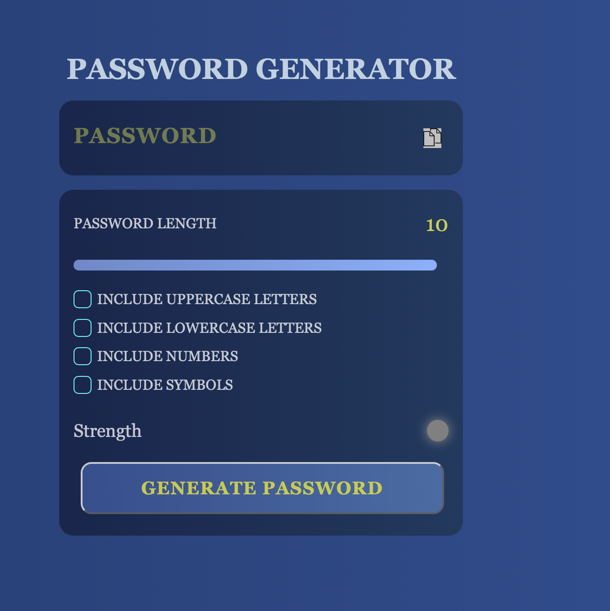

# 🔐 Password Generator

A sleek and customizable **Password Generator** built using **HTML**, **CSS**, and **JavaScript**. This tool allows you to instantly generate strong, secure passwords based on your preferences — making it easier to maintain good password hygiene.

---

## 🗂️ Project Structure

PasswordGenerator/
│
├── index.html # Main HTML file
├── style.css # CSS file for styling
├── script.js # JavaScript logic for password generation

## ✨ Features

- Generate random, secure passwords
- Customizable password length
- Option to include:
  - ✅ Uppercase letters
  - ✅ Lowercase letters
  - ✅ Numbers
  - ✅ Symbols
- Password strength indicator
- Copy password to clipboard with one click
- Responsive, modern design
  
---

## 🧩 Components Explained

### 📄 `index.html`

- Basic structure of the Password Generator
- Contains all necessary UI elements:
  - Password display area
  - Length slider
  - Character type checkboxes
  - Strength indicator
  - Generate button

---

### 🎨 `style.css`

- Handles the layout and design
- Clean, modern UI with a dark blue theme
- Responsive layout for desktop and mobile

---

### ⚡ `script.js`

- Generates random passwords based on user settings
- Calculates password strength dynamically
- Handles clipboard copy functionality

---
UI PREVIEW

